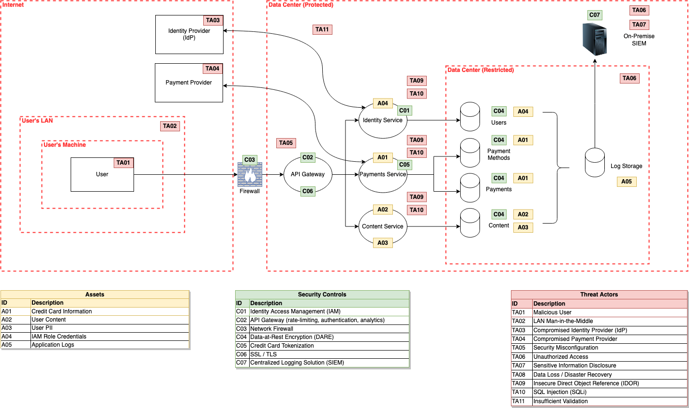

### Part I. (Questions)

```markdown
Q: Where can the payload come from?
A: A HTTP request

Q: Where can the payload execute?
A: The payload can execute on the web client or the mobile client

Q: Which component likely houses the code that needs remediation?
A: The reviews service contains the application code

Q: What considerations do you need to present to your management regarding this approach?  
A: Upon implementation, consider following these key guidelines:

- Prioritize remediations at the application level
- Only allow access from your vendor's firewall by configuring a `.htaccess` file
- DNS records should not point to the server's origin IP without it being proxied
- Stream firewall events to your SIEM for visibility and monitoring
- If using a shared hosting model, ensure emails are proxied through an external mailing solution (e.g., Office 365, G Suite)
- Decommission all unmaintained servers (this could potentially leak the service's infrastructure)

Q: Does the WAF mitigate the XSS risk to any degree?
A: A WAF is particularly effective against stored and reflective XSS. However, a DOM-based XSS is strictly client-side, rendering server-side filters useless. Likewise, many 0-day [disclosures](https://github.com/waf-bypass-maker/waf-community-bypasses/blob/main/payloads.twitter.csv) are made publicly available to security professionals 

Q: What other activities do you think may need to occur here?  
A: Aside from understanding the injection context, refer to these strategies:

- Check if HTML escaping has been disabled in the web application's framework
- Check the source code for any variables that might be marked as "safe"
- Sanitize input at the application and API level. Specifically, variables that can be controlled by the client (e.g., query strings, POST data, HTTP headers, and cookies)
- Enforce a strict content-security policy to allow/block specific scripts 
- Enforce content types for each request
- Configure the HTTP header `X-Content-Type-Options` with `nosniff` to stop the browser from automatically detecting content types
```

--------------------------------------------------------------------------------------------------------------------------------------------------------------------------------------

### Part II. (Diagram)


