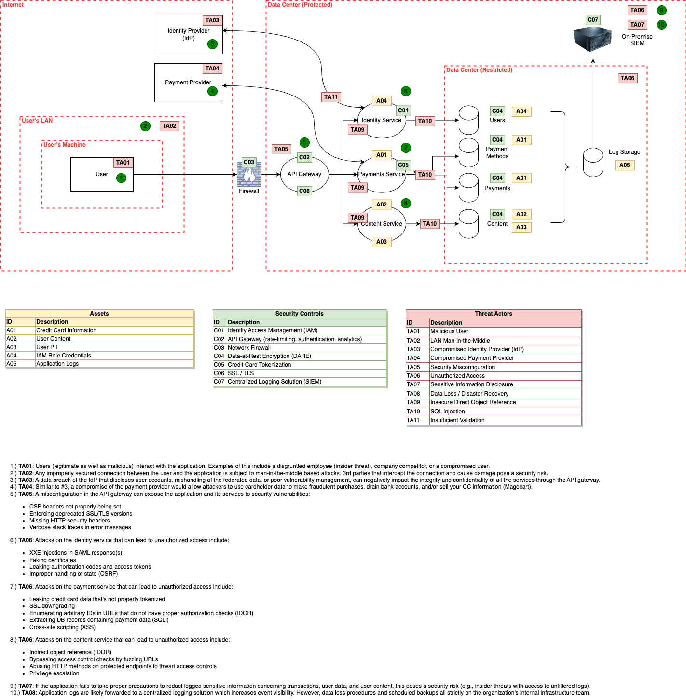

**Q**: Where can the payload come from?  
**A**: A web request that's sent from either the mobile or the web client

**Q**: Where can the payload execute?  
**A**: The code can execute through the web client, or the mobile client

**Q**: Which component likely houses the code that needs remediation?  
**A**: The Reviews Service, as this is where the application code resides

**Q**: What considerations do you need to present to your management regarding this approach?  
**A**: Understanding the injection context, first; this will determine the sanitization strategy (e.g., in between a HTML tag, inside of an HTML attribute, JavaScript, CSS, or in a URL). Prioritize remediating at the application level as the WAF acts as a secondary defense. Having a core development team that can mitigate ongoing security vulnerabilities will always be more cost effective than paying for additional WAF services. Upon implementation, consider the following:

- Only allow access from your vendor's firewall by configuring a `.htaccess` file
- DNS records should not point to the server's origin IP without it being proxied
- Stream WAF firewall events to your SIEM solution for visibility and monitoring
- If using a shared hosting model, ensure emails are proxied through an external mailing solution (e.g., Office 365, G Suite)
- Decommission all unmaintained servers (this could potentially leak the service's infrastructure)

**Q**: Does the WAF mitigate the XSS risk to any degree?  
**A**: A WAF can mitigate against *some* XSS attacks (it's particularly effective against catching stored and reflective), but if an adversary found a stored DOM-based injection, the server would never receive the input from the browser, rendering server-side filters useless. Likewise, many 0-day [bypasses](https://github.com/waf-bypass-maker/waf-community-bypasses/blob/main/payloads.twitter.csv) are disclosed and made publicly available for security researchers 

**Q**: What other activities do you think may need to occur here?  
**A**: WAFs are simply just a compensating control that need to be fine tuned to ensure that they work effectively. Here are some things to consider:

- Check if HTML escaping has been disabled in the web framework's configuration
- Inspect the source code for any variables that might be marked as "safe"
- Sanitize client input at the application and API level. Specifically, variables that can be controlled (e.g., query strings, POST data, headers, and cookies)
- Implement a strict content-security policy to place restrictions on what scripts are allowed to be loaded
- Enforce content types for each request
- Add the HTTP header `X-Content-Type-Options` (nosniff) to prevent the browser from automatically detecting the content type

